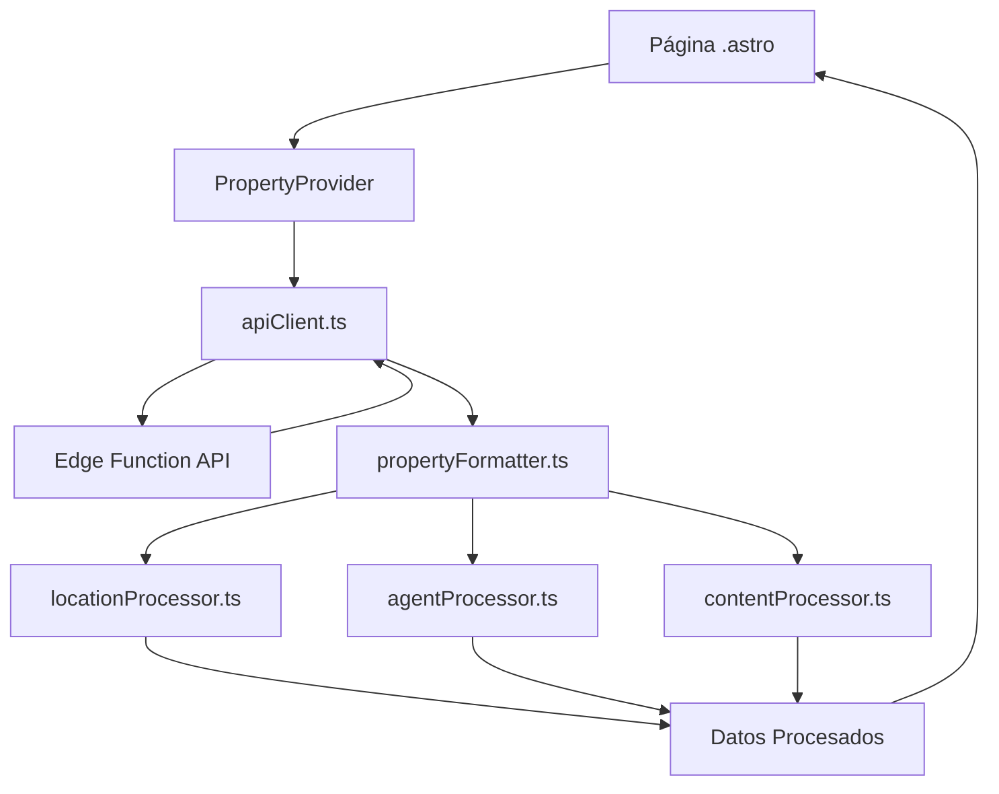

# CLIC Inmobiliaria - Arquitectura de Datos

## 📋 Resumen Ejecutivo

Este documento describe la arquitectura modular de datos implementada en CLIC Inmobiliaria para el manejo de propiedades, asesores y contenido. La arquitectura está diseñada para ser escalable, mantenible y reutilizable.

## 🏗️ Estructura General

```
src/data/
├── core/                     # Funcionalidades base compartidas
│   ├── constants.ts         # Configuración y constantes
│   ├── validation.ts        # Validaciones compartidas  
│   └── apiClient.ts         # Cliente API con cache
├── processors/              # Procesamiento de datos específicos
│   ├── locationProcessor.ts # Coordenadas y ubicación (PostGIS)
│   ├── agentProcessor.ts    # Formateo de asesores
│   ├── contentProcessor.ts  # FAQs, videos, breadcrumbs
│   └── utilityProcessors.ts # Funciones utilitarias
├── formatters/              # Formateo de respuestas finales
│   ├── propertyFormatter.ts # Single property
│   ├── listFormatter.ts     # Property list
│   └── projectFormatter.ts  # Detalles de proyectos
├── providers/               # Providers por dominio
│   └── propertyProvider.ts  # Provider de propiedades
└── types/
    └── interfaces.ts        # Definiciones de tipos
```

## 🔄 Flujo de Datos



## 📍 Manejo de Coordenadas

### Problema Resuelto
Las coordenadas llegan desde la API en formato PostGIS: `"(-70.4167,19.0333)"` y necesitan ser parseadas correctamente.

### Solución Implementada
```typescript
// locationProcessor.ts
export function parsePostGISCoordinates(postgisString: string): Coordinates | null {
  // Formato PostGIS: "(-70.4167,19.0333)" -> lng, lat
  const match = postgisString.match(/\(([-\d.]+),([-\d.]+)\)/);
  const lng = parseFloat(match[1]);
  const lat = parseFloat(match[2]);
  return { lat, lng };
}
```

### Jerarquía de Búsqueda de Coordenadas
1. `apiLocation.coordinates` (directo)
2. `apiLocation.property.location.coordinates`
3. `property.cities.coordinates` ⭐ (más común)
4. `property.sectors.coordinates`
5. `property.cities.provinces.coordinates`

## 👤 Manejo de Asesores

### Características
- Formateo de idiomas desde JSON/string/array
- Información de contacto con fallbacks
- Redes sociales completas
- Propiedades del asesor procesadas

### Campos Principales
```typescript
interface ProcessedAgent {
  name: string;
  phone: string;
  email: string;
  whatsapp: string;
  languages: string[];
  social: SocialLinks;
  stats: AgentStats;
}
```

## 📝 Manejo de Contenido

### FAQs
- **Prioridad 1**: Específicas de la propiedad
- **Prioridad 2**: Relacionadas por tags
- **Prioridad 3**: Generales de la API
- **Prioridad 4**: SEO Content
- **Prioridad 5**: Fallback predefinido

### Videos
- Extracción automática de YouTube IDs
- Soporte para múltiples fuentes (API + SEO Content)
- Fallback a video demo si no hay contenido

### Breadcrumbs
- Generación automática basada en jerarquía
- Fallback inteligente si no vienen de la API

## 🌐 API y Cache

### Cliente API Centralizado
```typescript
// Uso
const apiData = await callUnifiedAPI(segments, searchParams, 'single-property');
```

### Sistema de Cache
- **TTL**: 30 segundos
- **Tamaño máximo**: 50 entradas
- **Cleanup automático**: Cuando se supera el límite

### Timeouts por Contexto
- **Default**: 10 segundos
- **Search**: 15 segundos
- **Upload**: 30 segundos

## 🔧 Cómo Extender la Arquitectura

### 1. Agregar Nuevos Campos a Propiedades

**Archivo a modificar**: `src/data/formatters/propertyFormatter.ts`

```typescript
// En formatSinglePropertyResponse()
return {
  // ... campos existentes ...
  
  // ✨ NUEVOS CAMPOS
  newField: processNewField(apiData.newField),
  customData: {
    field1: apiData.custom?.field1,
    field2: formatCustomField(apiData.custom?.field2)
  }
};
```

### 2. Crear Nuevo Processor

**Ejemplo**: `src/data/processors/reviewProcessor.ts`

```typescript
export function processReviews(apiReviews: any[]): ProcessedReview[] {
  return apiReviews.map(review => ({
    id: review.id,
    rating: review.rating,
    comment: cleanDescription(review.comment),
    author: formatReviewAuthor(review.author)
  }));
}
```

**Usar en formatter**:
```typescript
import { processReviews } from '../processors/reviewProcessor.js';

// En propertyFormatter.ts
const reviews = processReviews(apiData.reviews);
```

### 3. Crear Nuevo Provider

**Ejemplo**: `src/data/providers/agentProvider.ts`

```typescript
export class AgentProvider {
  async getAgentProfile(agentSlug: string) {
    const apiData = await callUnifiedAPI(['asesor', agentSlug], undefined, 'agent-profile');
    
    return {
      agent: formatAgent(apiData.agent),           // ← Reutiliza processor
      properties: formatAgentProperties(apiData.properties), // ← Reutiliza processor
      testimonials: apiData.testimonials || []
    };
  }
}
```

## 📊 Datos Disponibles por Tipo

### Single Property Response
```typescript
{
  type: 'property',
  property: BasicPropertyInfo,
  images: string[],
  pricing: PricingData,
  agent: ProcessedAgent,
  location: ProcessedLocation,     // ← Coordenadas aquí
  amenities: Amenity[],
  content: ContentData,
  displayContent: {               // ← Contenido listo para mostrar
    faqs: ProcessedFAQs,
    videos: ProcessedVideos,
    articles: ProcessedArticles
  },
  similarProperties: Property[],
  agentProperties: Property[],     // ← Propiedades del asesor
  seo: SEOData,
  breadcrumbs: Breadcrumb[],
  meta: MetaData
}
```

### Property List Response
```typescript
{
  type: 'property-list',
  properties: ProcessedProperty[],
  pagination: PaginationData,
  search: SearchData,
  seo: SEOData,
  content: ListContentData,
  breadcrumbs: Breadcrumb[],
  meta: MetaData
}
```

## 🚀 Casos de Uso Comunes

### 1. Mostrar Mapa con Coordenadas
```astro
---
const { data } = Astro.props;
const coordinates = data.location.coordinates; // { lat: 19.0333, lng: -70.4167 }
---

{coordinates && (
  <div id="map" data-lat={coordinates.lat} data-lng={coordinates.lng}></div>
)}
```

### 2. Mostrar Información del Asesor
```astro
---
const agent = data.agent;
---

<div class="agent-card">
  
  <h3>{agent.name}</h3>
  <p>{agent.position}</p>
  <p>📞 {agent.phone}</p>
  <p>🗣️ {agent.languages.join(', ')}</p>
  <a href={agent.whatsapp}>WhatsApp</a>
</div>
```

### 3. Mostrar FAQs Procesados
```astro
---
const faqs = data.displayContent.faqs.faqs;
---

{faqs.map(faq => (
  <details>
    <summary>{faq.question}</summary>
    <p>{faq.answer}</p>
  </details>
))}
```

### 4. Mostrar Propiedades del Asesor
```astro
---
const agentProperties = data.agentProperties;
---

{data.hasAgentProperties && (
  <section>
    <h2>Más propiedades de {data.agent.name}</h2>
    {agentProperties.map(property => (
      <PropertyCard property={property} />
    ))}
  </section>
)}
```

## 🛠️ Troubleshooting

### Coordenadas no aparecen
1. **Verificar**: `data.location.coordinates` no es null
2. **Debug**: Revisar logs de `locationProcessor.ts`
3. **Comprobar**: Formato PostGIS en la API: `"(-70.4167,19.0333)"`

### Asesor no aparece
1. **Verificar**: `data.hasAgent` es true
2. **Debug**: Revisar `apiData.agent` o `apiData.referralAgent`
3. **Fallback**: Se muestra "CLIC Inmobiliaria" por defecto

### Contenido vacío
1. **Verificar**: `data.displayContent.faqs.totalCount > 0`
2. **Fallback**: FAQs y videos siempre tienen fallback automático

## 📈 Próximas Expansiones

### 1. AgentProvider
```typescript
// src/data/providers/agentProvider.ts
export class AgentProvider {
  async getAgentList() { /* ... */ }
  async getAgentProfile(slug: string) { /* ... */ }
  async getAgentProperties(id: string) { /* ... */ }
}
```

### 2. HomeProvider
```typescript
// src/data/providers/homeProvider.ts
export class HomeProvider {
  async getHomePageData() { /* ... */ }
  async getFeaturedProperties() { /* ... */ }
  async getFeaturedAgents() { /* ... */ }
}
```

### 3. TestimonialProvider
```typescript
// src/data/providers/testimonialProvider.ts
export class TestimonialProvider {
  async getTestimonials() { /* ... */ }
  async getFeaturedTestimonials() { /* ... */ }
}
```

## 💡 Best Practices

### 1. Naming Convention
- **Processors**: `processX`, `formatX`, `generateX`
- **Validators**: `isValidX`, `validateX`
- **Utilities**: `cleanX`, `sanitizeX`, `createX`

### 2. Error Handling
- Siempre tener fallbacks
- Log errores para debugging
- No romper la aplicación por datos faltantes

### 3. Performance
- Usar cache para llamadas repetidas
- Procesar solo datos necesarios
- Lazy loading de contenido pesado

### 4. Extensibilidad
- Processors reutilizables
- Interfaces bien definidas
- Separación de responsabilidades

## 🔗 Enlaces de Referencia

- **API Documentation**: Edge Function `/functions/v1/busqueda`
- **PostGIS Format**: `"(longitude,latitude)"` 
- **Cache TTL**: 30 segundos
- **Max Images**: 50 por propiedad
- **YouTube Regex**: Extrae IDs de 11 caracteres

---

**Última actualización**: Diciembre 2024  
**Versión**: 2.0 (Arquitectura Modular)  
**Mantenedor**: Equipo de Desarrollo CLIC